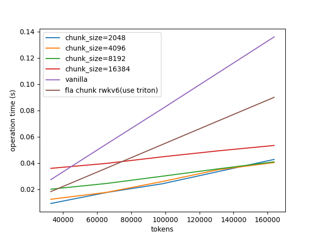

# chunk_RWKV6

使用分块并行优化RWKV的prefill和训练速度

# benchmark

在3090上测试，batch_size=1, head_num=32, head_size=64, channel=2048, 与RWKV6-1.6b设置相同

# Todolist

- 优化速度
- 增加反向传播
- 与continous batching结合
- 支持continous batching的后端推理引擎

# 参考

[flash-linear-attention](https://github.com/sustcsonglin/flash-linear-attention/tree/main)

[ChatRWKV](https://github.com/BlinkDL/ChatRWKV/tree/main)

# 柿子

forward:

每个block负责一个batch的一个head,每个thread负责一个channel,从0推到t

$$X=V\otimes K^T$$

$$S'=S*W+X$$

$$Y=(X*U+S)\otimes R$$

$$X_{t,h,i,j}=V_{t,h,i}K_{t,h,j}$$

$$S_{t,h,i,j}=S_{t-1,h,i,j}W_{t,h,j}+X_{t,h,i,j}$$

$$Y_{t,h,i}=\sum_{j}R_{t,h,j}(U_{h,j}X_{t,h,i,j}+S_{t-1,h,i,j})$$

$$Y_{t_1,h,i}=\sum_j R_{t_1,h,j}(U_{h,j}V_{t_1,h,i}K_{t_1,h,j}+\sum_{t_2=0}^{t_1-1}V_{t_2,h,i}K_{t_2,h,j}\prod_{t=t_2+1}^{t_1-1}W_{t,h,j}+S_{-1,h,i,j}\prod_{t=0}^{t_1-1}W_{t,h,j})$$

分块计算

$$w_{orig,i}=\sum_{0}^{i-1}w_j$$

$$\sum_{a-1}^{b-1}w_j=w_{orig,b}-w_{orig,a}$$

backword:

$$\frac{\partial Loss}{\partial R_{t,h,j}}=\sum_i\frac{\partial Loss}{\partial Y_{t,h,i}}(U_{h,j}X_{t,h,i,j}+S_{t-1,h,i,j})$$

$$\frac{\partial Loss}{\partial U_{h,j}}=\sum_t\sum_i \frac{\partial Loss}{\partial Y_{t,h,i}}R_{t,h,j}X_{t,h,i,j}$$

$$\frac{\partial Loss}{\partial V_{t_1,h,i}}=\frac{\partial Loss}{\partial Y_{t_1,h,i}}\sum_{j}U_{h,j}R_{t_1,h,j}K_{t_1,h,j}+\sum_{t_2=t_1+1}\frac{\partial Loss}{\partial Y_{t_2,h,i}}\sum_{j}R_{t_2,h,j}K_{t_1,h,j}(\prod_{t_3=t_1+1}^{t_2-1}W_{t_3,h,j})$$

$$=\frac{\partial Loss}{\partial Y_{t_1,h,i}}\sum_{j}U_{h,j}R_{t_1,h,j}K_{t_1,h,j}+\sum_{j}K_{t_1,h,j}\sum_{t_2=t_1+1}\frac{\partial Loss}{\partial Y_{t_2,h,i}}R_{t_2,h,j}(\prod_{t_3=t_1+1}^{t_2-1}W_{t_3,h,j})$$

令 $S_{t,h,j}=S_{t+1,h,j}W_{t,h,j}+\frac{\partial Loss}{\partial Y_{t,h,j}}R_{t,h,j}$

$$\frac{\partial Loss}{\partial V_{t_1,h,i}}=\sum_{j}(\frac{\partial Loss}{\partial Y_{t_1,h,i}}R_{t_1,h,j}U_{h,j}+S_{t+1,h,j})K_{t_1,h,j}$$

$K$ 同理

$$\frac{\partial Loss}{\partial W_{t_1,h,j}}=\sum_{t_2=t_1}\sum_{t_3=0}^{t_1-1}\sum_i \frac{\partial Loss}{\partial Y_{t_2,h,i}}R_{t_2,h,j}V_{t_3,h,i}K_{t_3,h,j}\prod_{t=t_3+1}^{t_1-1}W_{t,h,j}\prod_{t=t_1+1}^{t_2-1}W_{t,h,j}+\sum_{t_2=t_1}\sum_i \frac{\partial Loss}{\partial Y_{t_2,h,i}}R_{t_2,h,j}S_{-1,h,i,j}\prod_{t=0}^{t_1-1}W_{t,h,j}\prod_{t=t_1+1}^{t_2-1}W_{t,h,j}$$

$$W_{t_1,h,j}=\exp(-\exp(w_{t_1,h,j}))$$

其实要求的是 $w$ 的梯度

$$\frac{\partial Loss}{\partial w_{t_1,h,j}}=\frac{\partial Loss}{\partial W_{t_1,h,j}}\times \exp(-\exp(w_{t_1,h,j}))\times (-\exp(w_{t_1,h,j}))$$

正好把中间挖掉的一项补上了

$$\frac{\partial Loss}{\partial w_{t_1,h,j}}=(\sum_{t_2=t_1}\sum_{t_3=0}^{t_1-1}(\sum_i \frac{\partial Loss}{\partial Y_{t_2,h,i}}R_{t_2,h,j}V_{t_3,h,i}K_{t_3,h,j}\prod_{t=t_3+1}^{t_2-1}W_{t,h,j})+\sum_{t_2=t_1}\sum_i \frac{\partial Loss}{\partial Y_{t_2,h,i}}R_{t_2,h,j}S_{-1,h,i,j}\prod_{t=0}^{t_2-1}W_{t,h,j})\times (-\exp(W'_{t_1,h,j}))$$

这样，中间的括号里为 $t_2,t_3$ 的函数，总的减掉 $t_2,t_3$ 在 $t_1$ 同一侧的即可.
